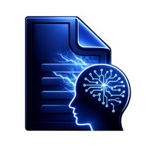
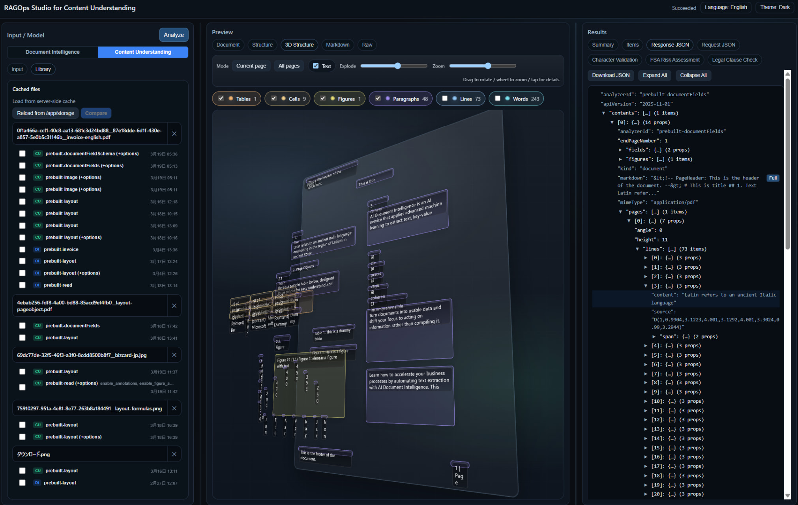
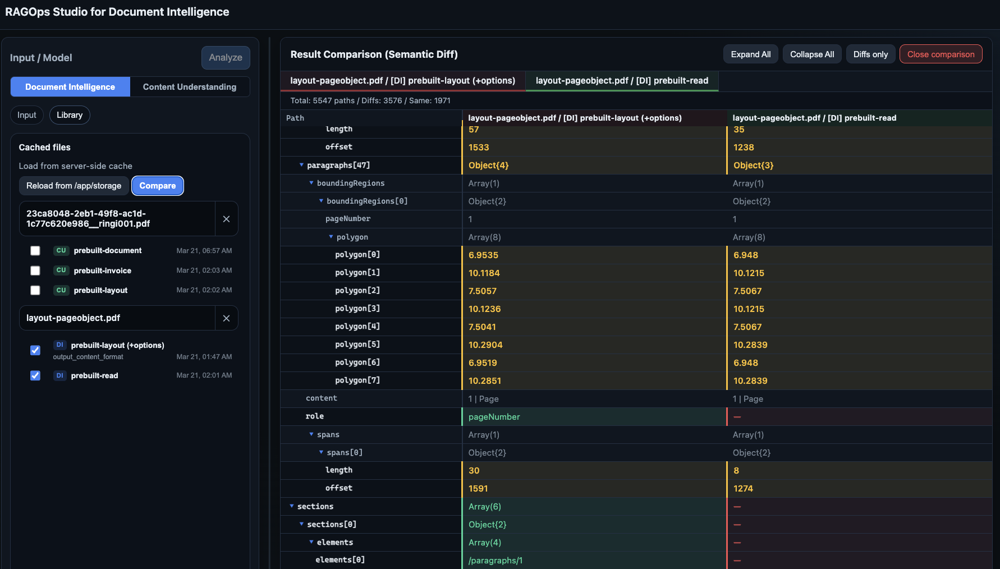

<p align="center">
  
</p>

# RAGOps Studio for Document Intelligence / Content Understanding


RAG パイプラインの起点である **ドキュメント解析** を「試す → 見る → 直す → 比較する」サイクルで磨き込むためのワークベンチ。Azure AI **Document Intelligence (DI)** と **Content Understanding (CU)** の両方に対応し、ローカルでもコンテナでも即座に動かせる軽量の Flask ベースの Web ツールです。

> 📦 **RAGOps Studio シリーズ**
> - [RAGOps Studio — for Azure AI Search](https://github.com/nohanaga/ragops-studio): 検索インデックスの品質を観測・比較・改善するための React/TypeScript ベースのワークベンチ（シリーズ第一弾）
> - **RAGOps Studio — for DI/CU**（本リポジトリ）: ドキュメント解析レイヤーを磨き込むためのワークベンチ

- English version: [README.md](README.md)
- デプロイガイド: [DEPLOYMENT_GUIDE.ja.md](DEPLOYMENT_GUIDE.ja.md)



## なぜ RAGOps Studio が必要か

RAG（Retrieval-Augmented Generation）の品質は、最初のドキュメント解析で決まります。モデルやオプションの違いが検索精度・回答品質にどう影響するかを素早くフィードバックできなければ、改善サイクルは回りません。

RAGOps Studio は、この **解析品質の継続的な観測・比較・改善** — いわゆる RAGOps の入り口 — を支えるためのツールです。

- **試す**: DI / CU のモデル・オプションをワンクリックで切り替えて解析
- **見る**: PDF/画像プレビュー上にバウンディングボックス (BBox) を重ね、「どこがどう取れているか」を視覚的に確認
- **直す**: オプションやモデルを変えてすぐ再実行。CU 派生アナライザーは自動管理
- **比較する**: 同一ドキュメントの複数バリアント結果をセマンティック Diff で構造比較

結果はすべてキャッシュされるため、API コストを抑えながら繰り返し検証できます。

### アーキテクチャ概要

- バックエンド: Flask（API + ジョブ管理 + ストレージ管理）
- フロントエンド: 素の HTML/CSS/JS（単一画面、Studio 風の 3 ペイン）
- 永続化: ローカルファイルシステム or Azure Blob Storage

## Features

### デュアルサービス対応

- **Document Intelligence (DI)** と **Content Understanding (CU)** を 1 つの画面で並行評価
- DI ↔ CU のワンクリック切り替え（サービスセレクター）
- DI: 30 種の組み込みモデル + カスタムモデル ID 手動入力
- CU: 47 種の組み込みアナライザー（リッチモデルピッカー：テキストフィルタリング・カテゴリグループ・米国専用トグル）

### 解析 & イテレーション

- Studio 風ワークフロー: ファイル選択 → モデル選択 → Analyze → Summary / Items / JSON 表示
- CU 非同期モード: 固定ワーカーで実行し、待機中も別文書・モデル・設定を操作可能。完了結果はジョブ一覧から復帰
- CU 同期モード: Read/Layout を前景実行し、入力コンテキストを完了までロック
- DI 解析オプション: `ocrHighResolution` / `formulas` / `barcodes` / `styleFont` / `pages` / `locale` / `output_content_format` / `query_fields` 等
- CU 解析オプション: GA 設定に加え、Preview の Agentic ワークフローとページ内分割に対応
- CU 派生アナライザー自動管理: オプション変更時に `studio.<source>.<hash>` で派生アナライザーを自動作成

### ビジュアルインスペクション

- **PDF ビューア**: pdf.js v5 による描画 + SVG バウンディングボックス (BBox) オーバーレイ (Lines / Words / Paragraphs / Tables / KVP / SelectionMarks / Figures / Formulas / Barcodes)
- **メディアビューア**: 音声/動画ファイルのプレビュー再生
- **3D Structure ビューア**: ドキュメント要素の 3D 分解ビュー（🥚 イースターエッグ — 実用機能ではなくジョーク機能です）
- 「JSON を読む」のではなく「結果を見る」ことで、チャンクの切れ目やフィールド抽出の誤りに即座に気付ける

### キャッシュ・ライブラリ（結果の蓄積と比較）

- 結果キャッシュ: 同一ファイル (SHA-256) + 同一モデル + 同一オプション (SHA-1 署名) でキャッシュし再利用 → API コストを抑えつつ繰り返し検証
- ライブラリ表示: キャッシュ済みファイルをカード形式で一覧、バリアント別ロード・削除
- **結果比較モード (セマンティック Diff)**: 「モデル A vs B」「オプション X vs Y」を構造レベルで比較し、差分をハイライト表示 — RAG パイプラインへの影響を事前に評価



### ユーザータブ（業務シナリオデモ）

- `usertab/<lang>/` に HTML を配置すると結果パネルにカスタムタブとして自動追加（多言語対応）
- **デモ専用機能**: 業務シナリオにおける AI エージェントの実行結果サンプルを静的 HTML で表示するための仕組みです。実際のエージェント呼び出しや動的処理は行いません
- 同梱サンプル: 文字バリデーション、FSA リスク判定、法的条項チェック — いずれもエージェント出力の「見え方」を確認するためのモックです
- `window.__USERTAB_API__` 経由で解析結果データにアクセスできるため、将来的なエージェント連携のプロトタイプ用途にも利用可能

### UX

- 日本語 / 英語 の完全クライアントサイド切替（i18n）— ユーザータブも言語連動
- 5 テーマ: Dark / Light / Midnight / Forest / Solarized
- 既定ではアップロード有効（`UPLOADS_ENABLED=false` で無効化可能）

### ストレージ

- **ローカルモード** (`STORAGE_BACKEND=local`): `storage/` ディレクトリにファイル保存（デフォルト）
- **Blob モード** (`STORAGE_BACKEND=blob`): Azure Blob Storage に直接保存（`DefaultAzureCredential` / Managed Identity 認証）

### 認証

DI / CU それぞれ独立した認証設定を持ちます（`DI_AUTH_MODE` / `CU_AUTH_MODE`）。

| モード | 環境変数値 | 挙動 |
|---|---|---|
| **Auto** (デフォルト) | `auto` | `DI_KEY`/`CU_KEY` があればキー認証、なければ `DefaultAzureCredential` (マネージド ID / Entra ID) にフォールバック |
| **Key** | `key` | 常に API キー認証。キー未設定時はエラー |
| **Identity** | `identity` | 常に `DefaultAzureCredential`。API キー不要 |

- Blob ストレージ (`STORAGE_BACKEND=blob`): 常に `DefaultAzureCredential` を使用 — ストレージアカウントキーは一切不要

## 前提

- Python 3.10+ 推奨
- 以下のいずれか（または両方）:
  - Azure AI Document Intelligence の `endpoint`（+ `key` またはマネージド ID）
  - Azure AI Content Understanding の `endpoint`（+ `key` またはマネージド ID）

## セットアップ

**macOS / Linux:**

```bash
cd <this-repo>
python3 -m venv .venv
source .venv/bin/activate
pip install -r requirements.txt
cp .env.example .env
```

**Windows (PowerShell):**

```powershell
cd <this-repo>
python -m venv .venv
.\.venv\Scripts\Activate.ps1
pip install -r requirements.txt
copy .env.example .env
```

`.env` を編集して、利用するサービスの環境変数を設定してください。

```bash
# Document Intelligence
DI_ENDPOINT=https://<your-di>.cognitiveservices.azure.com/
DI_KEY=<your-di-key>          # identity モードなら不要
# DI_AUTH_MODE=auto            # key / identity / auto (デフォルト: auto)

# Content Understanding
CU_ENDPOINT=https://<your-cu>.cognitiveservices.azure.com/
CU_KEY=<your-cu-key>
# CU_AUTH_MODE=auto

# 解析ジョブ
# ANALYSIS_WORKERS=4           # プロセスごとの同時解析数
# ANALYSIS_QUEUE_SIZE=32       # プロセスごとの待機ジョブ数

# ストレージ （デフォルト: local）
# STORAGE_BACKEND=local        # local / blob
# AZURE_STORAGE_ACCOUNT_NAME=  # blob モード時に必須
# AZURE_STORAGE_CONTAINER_NAME=appstorage

# UI
# UPLOADS_ENABLED=true         # false でアップロード無効化
# USER_TABS_ENABLED=false      # true でユーザータブを表示
# UI_DEFAULT_LANG=ja           # ja / en
```

### Content Understanding の API プロファイル

- 既定は GA `2025-11-01` です。Python SDK は `azure-ai-contentunderstanding>=1.1.0,<1.2.0` に固定しています。
- 画面では Preview `2026-06-01-preview` を常に選択できます。Preview を GA へ自動フォールバックすることはありません。
- Preview では Read/Layout の同期解析、Agentic ワークフロー、ページ内分割、Preview 税務アナライザーを利用できます。Preview は一般提供前であり、SLA はありません。
- 結果には API バージョン、実行方式、実効アナライザーを記録し、署名、文書メタデータ、セグメント、フィールド根拠を表示します。

公式資料: [Content Understanding の新機能](https://learn.microsoft.com/azure/ai-services/content-understanding/whats-new)、[同期 REST API](https://learn.microsoft.com/azure/ai-services/content-understanding/quickstart/use-synchronous-rest-api)

## 起動

```bash
python app.py
```

起動後に `http://127.0.0.1:5000/` を開いてください。

## RAGOps ワークフロー例

1. **ベースライン取得**: ドキュメントをアップロードし、まず DI `prebuilt-layout` で解析 → 結果をキャッシュ
2. **オプション探索**: `ocrHighResolution`、`formulas` などのオプションを変えて再解析 → バリアントが自動的にライブラリに蓄積
3. **比較・評価**: ライブラリから複数バリアントを選択 → セマンティック Diff で「どのオプションが自分のドキュメントに最適か」を判断
4. **CU との比較**: 同じドキュメントを CU アナライザーでも解析 → DI と CU の結果を並べて比較
5. **業務シナリオのデモ**: ユーザータブに業務 AI エージェントの実行結果サンプルを配置し、解析結果と並べて表示（静的 HTML モック）
6. **本番パイプラインへ反映**: 最適なモデル + オプションの組み合わせを特定し、RAG パイプラインのインジェスト設定に適用

## 注意

- 本ツールは RAG 開発・検証フェーズでの利用を想定しています。プロダクション環境で常時稼働させる場合は Queue/Worker アーキテクチャ + 適切な認証・認可の導入を推奨します。
- PDF プレビューは `static/vendor/pdfjs/` 配下に PDF.js があればローカル優先で読み込み、無ければ CDN にフォールバックします。
  - オフライン/閉域網で使う場合は、PDF.js（`pdfjs-dist` のビルド成果物）を `static/vendor/pdfjs/` に配置してください。

## Azure へのデプロイ

Azure Developer CLI (`azd`) を使うと、必要な Azure リソースの作成、コンテナーイメージのリモートビルド、Azure Container Apps への配置を `azd up` で実行できます。既存リソースを利用する Azure CLI スクリプト、Blob / SMB ストレージ、Managed Identity、Container Apps の設定値、Easy Auth の手順も用意しています。

詳細は **[デプロイガイド](DEPLOYMENT_GUIDE.ja.md)** を参照してください。

## ライセンス

このプロジェクトは [LICENSE](LICENSE) ファイルに基づいてライセンスされています。

これは個人的なプロジェクトであり、マイクロソフトの公式製品ではありません。本プロジェクトはコミュニティ主導で開発されており、現状のまま (AS-IS) で提供されます。マイクロソフトを含む開発者は、本ソフトウェアの使用に起因するいかなる問題についても責任を負わず、公式なサポートは提供されません。
