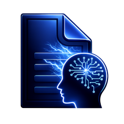
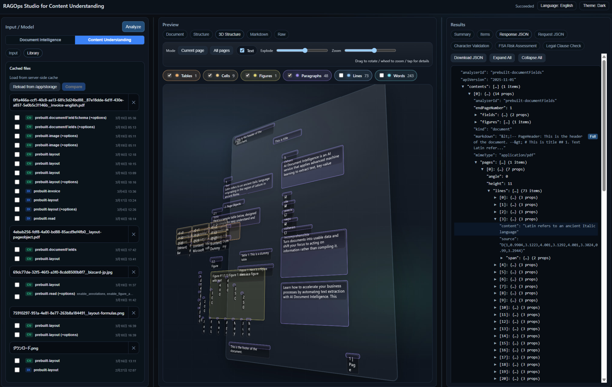
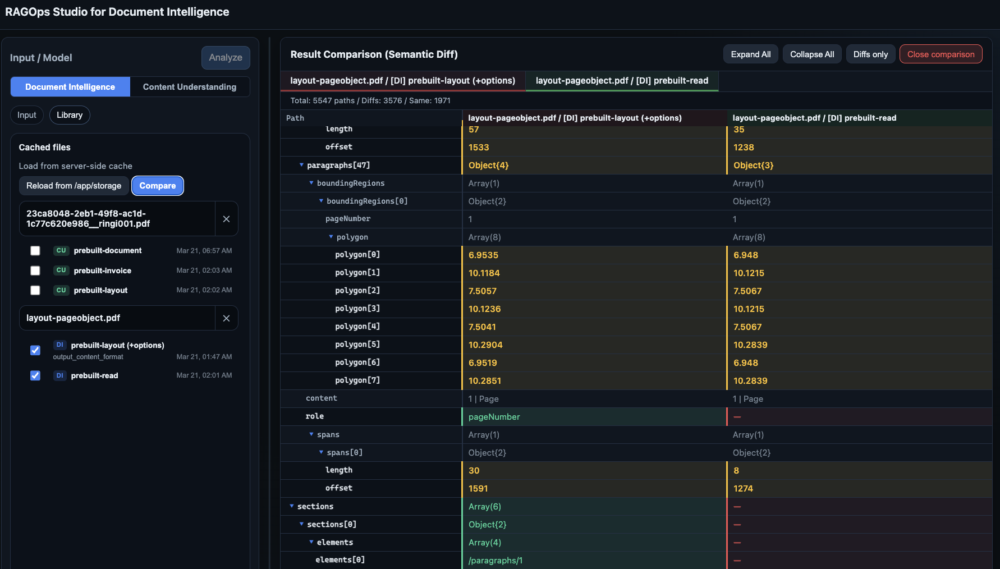

<p align="center">
  
</p>

# RAGOps Studio for Document Intelligence / Content Understanding


A workbench for refining the **document parsing layer** at the heart of every RAG pipeline. Iterate through analyze → inspect → adjust → compare cycles using Azure AI **Document Intelligence (DI)** and **Content Understanding (CU)**, all from a lightweight single browser-based tool that runs locally or in a container (Flask backend).

> 📦 **RAGOps Studio Series**
> - [RAGOps Studio — for Azure AI Search](https://github.com/nohanaga/ragops-studio): A React/TypeScript workbench for observing, comparing, and improving search index quality (Series #1)
> - **RAGOps Studio — for DI/CU** (this repo): A workbench for refining the document parsing layer

- 日本語版: [README.ja.md](README.ja.md)



## Why RAGOps Studio?

RAG quality starts with document extraction. A wrong model choice, a missing option, or an unseen edge case in your documents silently degrades retrieval accuracy and answer quality downstream. Without a fast feedback loop, these issues go unnoticed until production.

RAGOps Studio provides that feedback loop — the **observe → compare → improve** entry point for RAGOps:

- **Analyze**: Switch DI / CU models and options with one click, run extraction, view Summary / Items / JSON
- **Inspect**: Overlay bounding boxes (BBox) on PDF/image previews to *see* exactly what was extracted and where
- **Iterate**: Change options and re-run instantly; CU derived analyzers are managed automatically
- **Compare**: Semantic Diff across multiple cached variants — evaluate impact before committing to your RAG pipeline

All results are cached (file SHA-256 + model + options SHA-1), so you can iterate repeatedly without extra API cost.

### Architecture overview

- Backend: Flask (API + job management + storage management)
- Frontend: plain HTML/CSS/JS (single screen, Studio-like 3-pane layout)
- Persistence: local filesystem or Azure Blob Storage

## Features

### Dual-service support
- **Document Intelligence (DI)** and **Content Understanding (CU)** evaluated side-by-side in a single UI
- One-click DI ↔ CU switching (service selector)
- DI: 30 built-in models + custom model ID manual input
- CU: 47 built-in analyzers (rich model picker with text filtering, category groups, US-only toggle)

### Analysis & iteration
- Studio-like workflow: pick a file → select a model → Analyze → view Summary / Items / JSON
- Job execution: background thread SDK calls → poll by job ID → render results
- DI analysis options: `ocrHighResolution` / `formulas` / `barcodes` / `styleFont` / `pages` / `locale` / `output_content_format` / `query_fields`, etc.
- CU analysis options: 16 of 18 Processing Configuration parameters supported (89% coverage)
- CU derived analyzer auto-management: when options change, automatically creates `studio.<source>.<hash>` derived analyzers

### Visual inspection
- **PDF viewer**: pdf.js v5 rendering + SVG bounding box (BBox) overlay (Lines / Words / Paragraphs / Tables / KVP / SelectionMarks / Figures / Formulas / Barcodes)
- **Media viewer**: audio/video file preview playback
- **3D Structure viewer**: 3D exploded view of document elements (🥚 Easter egg — a joke feature, not a practical tool)
- *See* results instead of reading JSON — spot chunk boundaries, field extraction errors, and OCR issues instantly

### Cache & Library (result accumulation and comparison)
- Result caching: caches by file (SHA-256) + model + options (SHA-1 signature) to reuse results → iterate without extra API cost
- Library view: lists cached files as cards, per-variant loading and deletion
- **Result comparison mode (Semantic Diff)**: compare “Model A vs B” or “Option X vs Y” at a structural level with highlighted differences — evaluate downstream RAG impact before committing

    

### User tabs (business scenario demo)
- Place HTML files in `usertab/<lang>/` to auto-add custom tabs to the result panel (multi-language support)
- **Demo-only feature**: displays static HTML mockups of AI agent execution results for various business scenarios. No actual agent invocation or dynamic processing is performed
- Bundled samples: Character Validation, FSA Risk Assessment, Legal Clause Check — all are mockups to showcase how agent output *would look* in a real workflow
- `window.__USERTAB_API__` provides access to extraction result data, making it useful for prototyping future agent integrations

### UX
- Full client-side Japanese / English switching (i18n) — user tabs language-synced
- 5 themes: Dark / Light / Midnight / Forest / Solarized
- Uploads enabled by default (disable via `UPLOADS_ENABLED=false`)

### Storage
- **Local mode** (`STORAGE_BACKEND=local`): saves to `storage/` directory (default)
- **Blob mode** (`STORAGE_BACKEND=blob`): saves directly to Azure Blob Storage (`DefaultAzureCredential` / Managed Identity auth)

### Authentication

DI and CU each have independent auth settings via `DI_AUTH_MODE` / `CU_AUTH_MODE`:

| Mode | Env value | Behavior |
|---|---|---|
| **Auto** (default) | `auto` | Uses API key if `DI_KEY`/`CU_KEY` is set, otherwise falls back to `DefaultAzureCredential` (Managed Identity / Entra ID) |
| **Key** | `key` | Always uses API key auth. Key must be set or an error is raised |
| **Identity** | `identity` | Always uses `DefaultAzureCredential`. No API key required |

- Blob storage (`STORAGE_BACKEND=blob`): always uses `DefaultAzureCredential` — keyless auth only, no storage account key involved

## Prerequisites

- Python 3.10+ recommended
- One or both of:
  - Azure AI Document Intelligence `endpoint` (+ `key` or Managed Identity)
  - Azure AI Content Understanding `endpoint` (+ `key` or Managed Identity)

## Setup

```powershell
cd <this-repo>
python -m venv .venv
.\.venv\Scripts\Activate.ps1
pip install -r requirements.txt
copy .env.example .env
```

Edit `.env` and set environment variables for the services you use:

```bash
# Document Intelligence
DI_ENDPOINT=https://<your-di>.cognitiveservices.azure.com/
DI_KEY=<your-di-key>          # not needed for identity mode
# DI_AUTH_MODE=auto            # key / identity / auto (default: auto)

# Content Understanding (optional)
# CU_ENDPOINT=https://<your-cu>.cognitiveservices.azure.com/
# CU_KEY=<your-cu-key>
# CU_AUTH_MODE=auto

# Storage (default: local)
# STORAGE_BACKEND=local        # local / blob
# AZURE_STORAGE_ACCOUNT_NAME=  # required for blob mode
# AZURE_STORAGE_CONTAINER_NAME=appstorage

# UI
# UPLOADS_ENABLED=true         # set false to disable uploads
# UI_DEFAULT_LANG=ja           # ja / en
```

## Run

```powershell
python app.py
```

Open `http://127.0.0.1:5000/`.

## RAGOps workflow example

1. **Establish a baseline**: Upload a document, analyze with DI `prebuilt-layout` → cache the result
2. **Explore options**: Re-analyze with `ocrHighResolution`, `formulas`, etc. → variants accumulate in the Library automatically
3. **Compare & evaluate**: Select multiple variants from the Library → Semantic Diff shows "which option works best for my documents"
4. **Cross-service comparison**: Analyze the same document with a CU analyzer → compare DI and CU results side by side
5. **Business scenario demo**: Place AI agent execution result samples in user tabs and display them alongside extraction results (static HTML mockups)
6. **Feed back to production**: Identify the optimal model + options combination, apply it to your RAG pipeline’s ingestion config

## Notes

- This tool is designed for the RAG development and validation phase. For always-on production workloads, consider a Queue/Worker architecture with proper auth/authz.
- PDF preview loads PDF.js from `static/vendor/pdfjs/` if present (local first), otherwise falls back to a CDN.
  - For offline/air-gapped environments, place PDF.js build artifacts (from `pdfjs-dist`) under `static/vendor/pdfjs/`.

## Deploy to Azure Container Apps

### Prerequisites

- Azure CLI installed
- Logged in via `az login`
- DI / CU endpoint (+ key or Managed Identity) available

### Storage modes

The deploy script supports 2 storage modes:

| Mode | Script option | Persistence method | Storage auth |
|---|---|---|---|
| **SMB** (default) | `-StorageMode smb` | Azure Files volume mount (`/app/storage`) | Storage account key (SMB constraint) |
| **Blob** | `-StorageMode blob` | Azure Blob Storage SDK direct R/W | Managed Identity (`DefaultAzureCredential`) |

- **SMB mode**: script auto-configures Storage Account / File Share creation → CAE storage registration → volume mount
- **Blob mode**: script auto-configures Storage Account creation (`allowSharedKeyAccess=false`) → system-assigned MI → `Storage Blob Data Contributor` role → Blob container creation

> ⚠️ If Azure Policy enforces `allowSharedKeyAccess=false`, SMB mode won't work. Use `-StorageMode blob` instead.

### DI auth modes

The deploy script auto-configures DI authentication:

| Mode | Script option | Description |
|---|---|---|
| **Key** (default) | `-DiAuthMode key` | API key stored as Container Apps secret |
| **Identity** | `-DiAuthMode identity` | System-assigned MI enabled + auto-assigned `Cognitive Services User` role |

### CU auth modes

The deploy script also supports CU authentication with the same patterns:

| Mode | Script option | Description |
|---|---|---|
| **Key** (default) | `-CuAuthMode key` | API key stored as Container Apps secret |
| **Identity** | `-CuAuthMode identity` | System-assigned MI enabled + auto-assigned `Cognitive Services User` role |

> 💡 At least one of DI or CU must be configured (endpoint provided). You can deploy with DI only, CU only, or both.

### Deploy (create on first run, update afterwards)

**Pattern 1: DI key auth + SMB storage (simplest)**

```powershell
$env:DI_ENDPOINT = "https://<your-di>.cognitiveservices.azure.com/"
$env:DI_KEY = "<your-di-key>"

./scripts/deploy_aca.ps1 `
    -Location japaneast `
    -ResourceGroupName rg-ragops-studio `
    -AcrName <uniqueacrname>
```

**Pattern 2: DI Managed Identity + Blob storage (keyless)**

```powershell
$env:DI_ENDPOINT = "https://<your-di>.cognitiveservices.azure.com/"

./scripts/deploy_aca.ps1 `
    -Location japaneast `
    -ResourceGroupName rg-ragops-studio `
    -AcrName <uniqueacrname> `
    -DiAuthMode identity `
    -DiResourceName <your-di-resource-name> `
    -StorageMode blob
```

**Pattern 3: DI + CU (both key auth)**

```powershell
$env:DI_ENDPOINT = "https://<your-di>.cognitiveservices.azure.com/"
$env:DI_KEY = "<your-di-key>"

./scripts/deploy_aca.ps1 `
    -Location japaneast `
    -ResourceGroupName rg-ragops-studio `
    -AcrName <uniqueacrname> `
    -CuEndpoint "https://<your-cu>.cognitiveservices.azure.com/" `
    -CuKey "<your-cu-key>"
```

**Pattern 4: DI + CU (both Managed Identity, keyless)**

```powershell
$env:DI_ENDPOINT = "https://<your-di>.cognitiveservices.azure.com/"

./scripts/deploy_aca.ps1 `
    -Location japaneast `
    -ResourceGroupName rg-ragops-studio `
    -AcrName <uniqueacrname> `
    -DiAuthMode identity `
    -DiResourceName <your-di-resource-name> `
    -CuEndpoint "https://<your-cu>.cognitiveservices.azure.com/" `
    -CuAuthMode identity `
    -CuResourceName <your-cu-resource-name> `
    -StorageMode blob
```

**Pattern 5: CU only (key auth)**

```powershell
./scripts/deploy_aca.ps1 `
    -Location japaneast `
    -ResourceGroupName rg-ragops-studio `
    -AcrName <uniqueacrname> `
    -CuEndpoint "https://<your-cu>.cognitiveservices.azure.com/" `
    -CuKey "<your-cu-key>"
```

**Options**

| Parameter | Description |
|---|---|
| `-UploadsEnabled $true` | Enable uploads |
| `-StorageAccountName "name"` | Explicit storage account name (auto-generated if omitted) |
| `-StorageShareName "name"` | File share name (SMB mode, default: `appstorage`) |
| `-StorageShareQuotaGiB 20` | File share size (SMB mode, default: 10 GiB) |
| `-BlobContainerName "name"` | Blob container name (Blob mode, default: `appstorage`) |
| `-DiAuthMode key\|identity` | DI authentication mode (default: `key`) |
| `-DiResourceName "name"` | DI resource name (RBAC scope for identity mode) |
| `-DiResourceGroupName "name"` | DI resource group (defaults to `-ResourceGroupName`) |
| `-CuEndpoint "url"` | CU endpoint URL |
| `-CuKey "key"` | CU API key (key mode) |
| `-CuAuthMode key\|identity` | CU authentication mode (default: `key`) |
| `-CuResourceName "name"` | CU resource name (RBAC scope for identity mode) |
| `-CuResourceGroupName "name"` | CU resource group (defaults to `-ResourceGroupName`) |

### Update

Re-run the same command to rebuild/push the image and update the Container App.

- Usually you do NOT need to re-set endpoints/keys (secrets/env are kept).
- To rotate keys, pass `-DiKey` / `-CuKey` to update secrets.
- To switch auth mode, pass the new `-DiAuthMode` / `-CuAuthMode` value.


## License

This project is licensed under the terms specified in the [LICENSE](LICENSE) file.


This is a personal project and is not an official Microsoft product. This project is community-driven and provided AS-IS without any warranties. The developers, including Microsoft, assume no responsibility for any issues arising from the use of this software, and no official support is provided.
